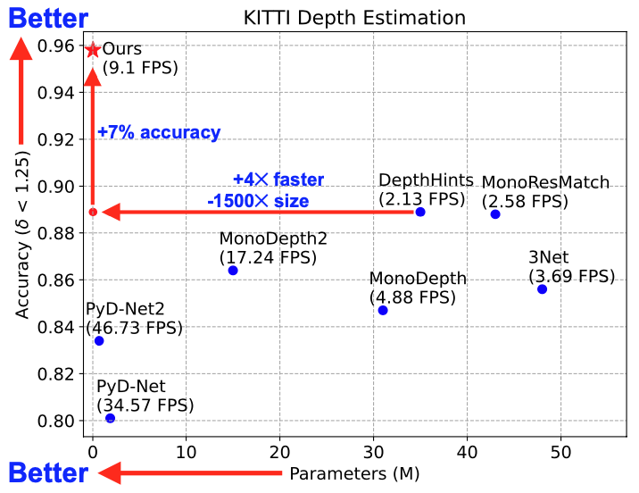

# ES³Net: Accurate and Efficient Edge-Based Self-Supervised Stereo Matching Network
[[CVPRW2023]](https://openaccess.thecvf.com/content/CVPR2023W/EVW/html/Fang_ES3Net_Accurate_and_Efficient_Edge-Based_Self-Supervised_Stereo_Matching_Network_CVPRW_2023_paper.html)

This repository is the official source code (with PyTorch) for our CVPR 2023 Workshops ([EVW](https://embeddedvisionworkshop.wordpress.com/)) paper, ES³Net: Accurate and Efficient Edge-based Self-Supervised Stereo Matching Network. 

## TL;DR
We adapt the efficient cost-volume-based stereo matching network ([RealTimeStereo](https://github.com/JiaRenChang/RealtimeStereo)) to self-supervised learning, allowing us to estimate **metric** depth and to fine-tune the network on embedded devices, such as the drone. 

 


## Abstract
Efficient and accurate depth estimation is crucial for real-world embedded vision applications, such as autonomous driving, 3D reconstruction, and drone navigation. Stereo matching is considered more accurate than monocular depth estimation due to the presence of a reference image, but its computational inefficiency poses a challenge for its deployment on edge devices. Moreover, it is difficult to acquire ground-truth depths for supervised training of stereo matching networks. To address these challenges, we propose **E**dge-based **S**elf-**S**upervised **S**tereo matching **N**etwork (ES³Net), which efficiently estimates accurate depths without ground-truth depths for training. We introduce dual disparity to transform an efficient supervised stereo matching network into a self-supervised learning framework. Comprehensive experimental results demonstrate that ES³Net has comparable accuracy with stereo methods while outperforming monocular methods in inference time, approaching state-of-the-art performance. The efficient and reliable estimation of depths on edge devices using ES³Net lays a good foundation for safe drone navigation.

## Environment
We provide a YAML file for building the environment with conda. 
```
conda env create -f environment.yml
```
You can also manually build up the environment by installing dependency in the environment.yml.

## Train
We use the same data loaders of [PSMNet](https://github.com/JiaRenChang/PSMNet) and [RealTimeStereo](https://github.com/JiaRenChang/RealtimeStereo). Please modify the dataset as these works.
```
python train.py --data_path <dataset path> --dataset <dataset name>
```
If you want to use your own dataset, please use `self` as the dataset name

## Test
### For single pair of images
```
python test.py --load_cpt_path <model checkpoint path> \ 
                --imgL_path <left image path> --imgR_path <right image path> \
                --save_path <path for saving disparity map>
```
### For multiple pairs of images
If you want to test multiple pairs, you need to create two directories, "RGB_left" and "RGB_right", under the main directory.
```
python test.py --load_cpt_path <model checkpoint path> \
               --data_path <dataset path> --save_path <path for saving disparity map>
```
## Pre-trained Model Checkpoint
We provide the model checkpoint pre-trained on KITTI Raw in this repository.
The filename of checkpoint is `ES3Net_kitti_raw_best.cpt`.

## Citations
```Bibtex
@InProceedings{Fang_2023_CVPR,
    author    = {Fang, I-Sheng and Wen, Hsiao-Chieh and Hsu, Chia-Lun and Jen, Po-Chung and Chen, Ping-Yang and Chen, Yong-Sheng},
    title     = {ES3Net: Accurate and Efficient Edge-Based Self-Supervised Stereo Matching Network},
    booktitle = {Proceedings of the IEEE/CVF Conference on Computer Vision and Pattern Recognition (CVPR) Workshops},
    year      = {2023},
}
```
## Acknowledgement
This code is based on [PSMNet](https://github.com/JiaRenChang/PSMNet), [RealTimeStereo](https://github.com/JiaRenChang/RealtimeStereo) and [monodepth](https://github.com/mrharicot/monodepth)
